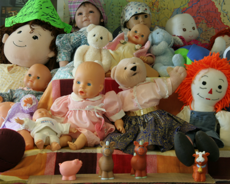

# Two-View Stereo
This was just a fun little implementation to test out some of the stuff I learned in my computer vision lecture. After learning about depth from disparity I kinda just wanted to see how well the basic implementation worked.

| Left Image      | Right Image | Depth Visualization |
| :---: | :---: | :---: |
| | ||
| | ||
| | ||
| | ||
| | ||
| | ||
| | ||
|| ||
